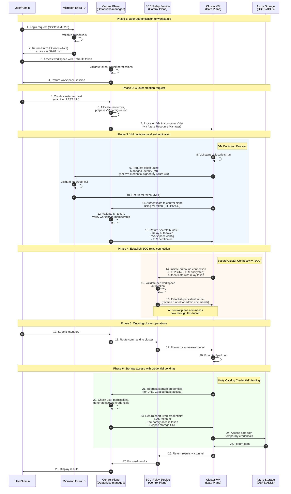
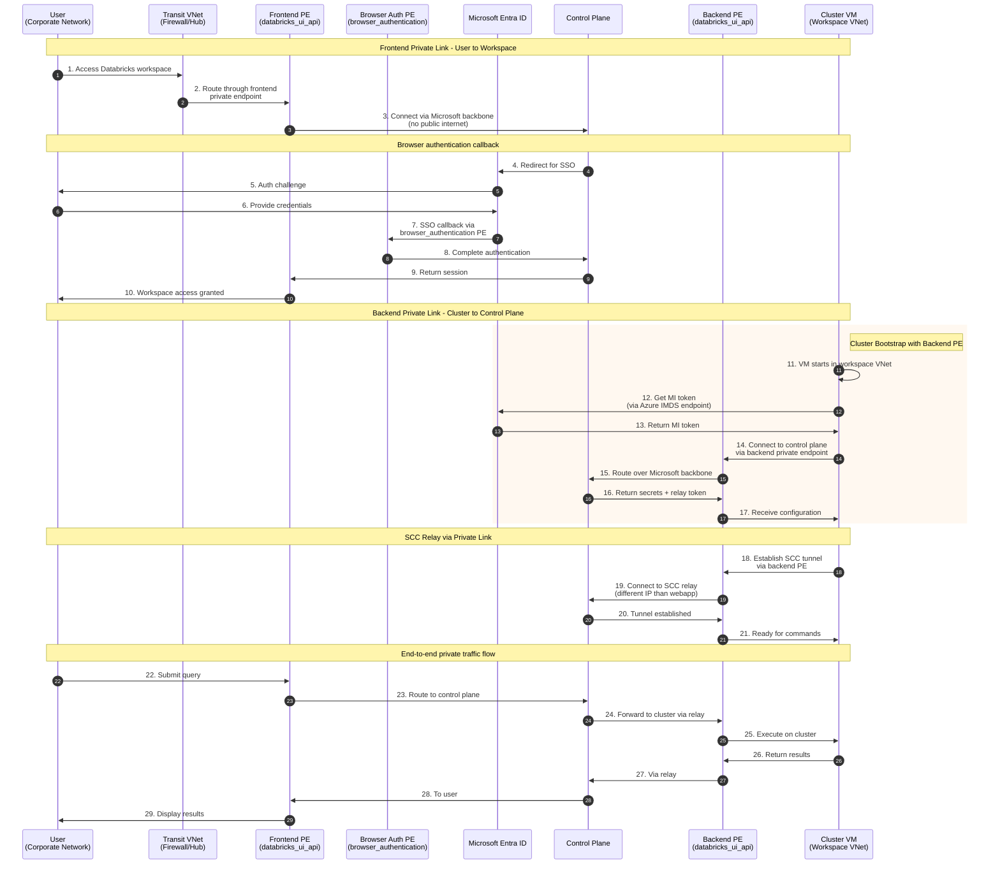

# Life of a Query: Databricks Azure Token Vending Flow

This document details the authentication and token vending flow for Databricks on Azure, including how VMs/clusters in the data plane obtain tokens from the control plane, the role of Entra ID (Azure AD), and how Private Link fits into the architecture.

## Architecture overview

```
+---------------------------+     +---------------------------+
|      CONTROL PLANE        |     |        DATA PLANE         |
|   (Databricks-managed)    |     |   (Customer subscription) |
+---------------------------+     +---------------------------+
| - Web Application         |     | - Cluster VMs (Driver +   |
| - REST API                |     |   Workers)                |
| - Cluster Manager         |     | - Workspace VNet          |
| - SCC Relay Service       |     | - NAT Gateway / Firewall  |
| - Token Vending Service   |     | - DBFS Storage            |
+---------------------------+     +---------------------------+
            ^                                  |
            |      Microsoft Azure Backbone    |
            +----------------------------------+
```

## Sequence diagram: VM bootstrap and token vending



## Sequence diagram: Private Link architecture



## Token types and lifetimes

| Token Type | Issued By | Lifetime | Purpose |
|------------|-----------|----------|---------|
| Entra ID User Token | Microsoft Entra ID | 60-90 minutes | User authentication to workspace |
| Managed Identity Token | Microsoft Entra ID | ~1 hour | VM authentication to control plane |
| Relay Auth Token | Databricks Control Plane | Session-based | Authenticate VM to SCC relay |
| Unity Catalog Credential | Databricks Control Plane | Short-lived (minutes) | Scoped access to cloud storage |
| Databricks OAuth Token | Databricks OIDC endpoint | Matches source token | API access after token exchange |

## Key security properties

### Secure Cluster Connectivity (SCC)
- **No public IPs**: Cluster VMs have no public IP addresses
- **No inbound ports**: Customer VNet has no open inbound ports
- **Outbound only**: All connections initiated by cluster (outbound HTTPS/443)
- **Reverse tunnel**: Control plane commands sent via reverse tunnel
- **TLS encrypted**: All traffic encrypted with Databricks server certificates

### Private Link benefits
- **Frontend PE**: User traffic never traverses public internet
- **Backend PE**: Cluster-to-control plane traffic stays on Microsoft backbone
- **Browser Auth PE**: SSO callbacks handled privately (required for frontend PE)
- **DNS resolution**: Private DNS zones route to private IPs

## Network flow summary

### Without Private Link (SCC only)
```
User --> [Internet] --> Control Plane
Cluster VM --> [Azure Backbone] --> Control Plane (via NAT Gateway)
```

### With Frontend Private Link only
```
User --> [Private Network] --> Frontend PE --> [Azure Backbone] --> Control Plane
Cluster VM --> [Azure Backbone] --> Control Plane (via NAT Gateway, public endpoint)
```

### With Backend Private Link only
```
User --> [Internet] --> Control Plane
Cluster VM --> Backend PE --> [Azure Backbone] --> Control Plane
```

### End-to-end Private Link
```
User --> [Private Network] --> Frontend PE --> [Azure Backbone] --> Control Plane
Cluster VM --> Backend PE --> [Azure Backbone] --> Control Plane
(No public internet exposure at any point)
```

## References

- [Azure Private Link concepts - Azure Databricks](https://learn.microsoft.com/en-us/azure/databricks/security/network/classic/private-link)
- [High-level architecture - Azure Databricks](https://learn.microsoft.com/en-us/azure/databricks/getting-started/high-level-architecture)
- [Enable secure cluster connectivity - Azure Databricks](https://learn.microsoft.com/en-us/azure/databricks/security/network/classic/secure-cluster-connectivity)
- [Configure back-end private connectivity - Azure Databricks](https://learn.microsoft.com/en-us/azure/databricks/security/network/classic/private-link-standard)
- [Unity Catalog credential vending - Azure Databricks](https://learn.microsoft.com/en-us/azure/databricks/external-access/credential-vending)
- [Authenticate with identity provider token exchange - Azure Databricks](https://learn.microsoft.com/en-us/azure/databricks/dev-tools/auth/oauth-federation-exchange)
- [Databricks on Azure - An Architecture Perspective (Bluetab)](https://www.bluetab.net/en/databricks-on-azure-an-architecture-perspective-part-1/)
- [VM bootstrap and authentication (Databricks Community)](https://community.databricks.com/t5/data-engineering/vm-bootstrap-and-authentication-when-a-vm-boots-up-it/td-p/19742)
